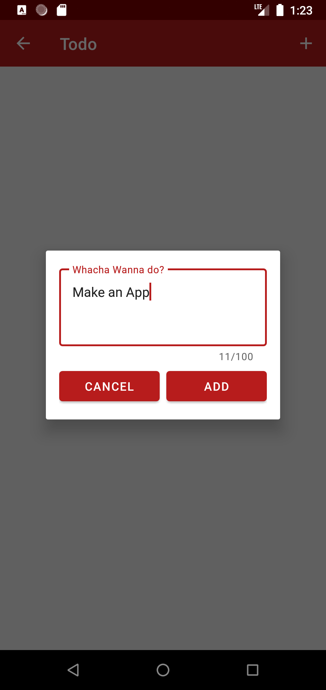

# TODO APP

I decided to create a Todo App.

#### Things in App
    * Room Database
    * ViewModel
    * Sealed class UIStates
    * View/Data Binding

#### App Functionality
    [x] Add Task
    [x] Remove Task
    [x] Edit Task
    [x] Complete Task

    

